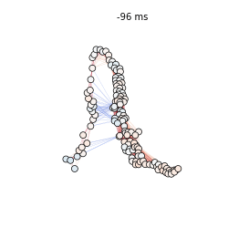
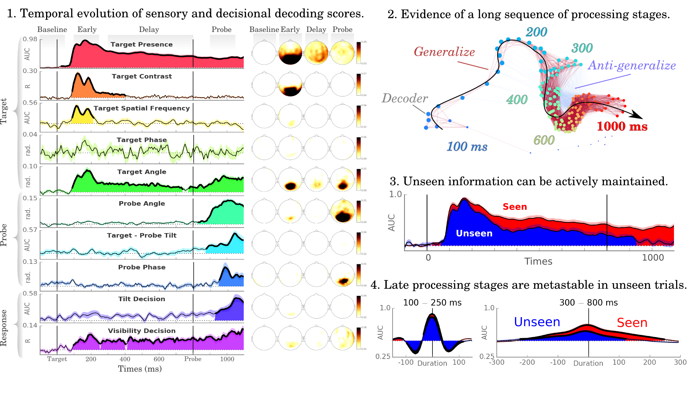

Selective maintenance of seen and unseen sensory features in the human brain
============================================================================

This repository stores all scripts to analyze MEG data from the eponymous manuscript, by Jean-Remi King, Niccolo Pescetelli & Stanislas Dehaene.

The corresponding manuscript has been submitted and **is currently not peer-reviewed**. The preprint pdf can be downloaded from [BioArXiv](http://biorxiv.org/content/early/2016/02/18/040030).

Highlights
==========

* Recent studies challenge the equivalence between visual awareness and working memory.
* We investigated human MEG activity while subjects memorized visual stimuli presented at visibility threshold.
* Decoding analyses allowed tracking a rich set of sensory and decision features.
* Task-relevant features are specifically maintained during the retention period.
* Unseen but task-relevant features can be maintained by late neural assemblies.

Online Tutorials and Results
============================

Click on the following links to run the tutorials and results preview in your browser.
* [`method_decoding.ipynb`](http://mybinder.org/repo/kingjr/decoding_unconscious_maintenance/notebook/method_decoding.ipynb) explains the general procedure used to perform decoding with MEG data.
* [`method_model_types.ipynb`](http://mybinder.org/repo/kingjr/decoding_unconscious_maintenance/notebook/method_model_types.ipynb) explains how categorical, ordinal and circular models can be fitted and scored.
* [`method_statistics.ipynb`](http://mybinder.org/repo/kingjr/decoding_unconscious_maintenance/notebook/method_statistics.ipynb) explains how the statistics are performed in the manuscript.
* [`results_summary.ipynb`](http://mybinder.org/repo/kingjr/decoding_unconscious_maintenance/notebook/results_summary.ipynb) gives a preview of some of the results to allow user to replicate our analyses, or go further by looking at individual subjects, test other statistical methods etc.

Also consider looking at the [MNE-Python gallery](http://martinos.org/mne/dev/auto_examples/). You will find several examples, showing how the `TimeDecoding` and `GeneralizationAcrossTime` can be used.

Scripts
=======

Overall, the scripts remain designed for research purposes, and could therefore be improved and clarified. If you judge that some codes would benefit from specific clarifications do not hesitate to raise an issue.

The scripts are generally decomposed in terms of general functions (base), actual analyses (decoding, cluster analyses), and report (plotting, tables, quick stats).

- `conditions.py` defines the analyses at a high level: how are the contrasts defined (e.g. decoding of the presence, phase etc), which conditions to include and exclude, what statistical pipeline to use depending (circular, linear, categorical) etc.

- `config.py` defines the data handling: data paths, downloading scheme (when run on a distant server), subjects to include in the analyses, time regions of interest etc. This is generally the script that one can modify to run the analyses in a more or less fast manner.

- `base.py` contains all generic functions.

- `run_behavior.py` analyses all behavioral data.

- `run_sensor_analysis.py` pipeline to compute univariate analyses for each subject and each analysis.

- `run_stats_sensors.py` pipeline to compute 2nd order stats across subjects for univariate effects.

- `plot_stats_sensors.py` outputs the main topographical effects.

- `run_decoding.py` pipeline to compute decoding and temporal generalization for each subject and each analysis.

- `run_stats_decoding.py` pipeline to compute 2nd order stats across subjects for decoding and temporal generalization effects.

- `plot_stats_decoding.py` outputs the main decoding figures.

- `plot_graphs` transform the temporal generalization matrices in terms of animated graphs.

The other `run_*` as well as `plot_*` scripts are generally designed for control analyses, typically aiming at investigating properties of decoding scores as a function of time, visibility etc. These script are under documented. Do not hesitate to ask me for clarifications.

Data
====

The available data is currently partial. The complete data and non truncated results will be made publicly available once the paper is accepted for publication.

Dependencies
============

See `requirements.txt`

Acknowledgements
================

This project is powered by

and JRK received fundings from

